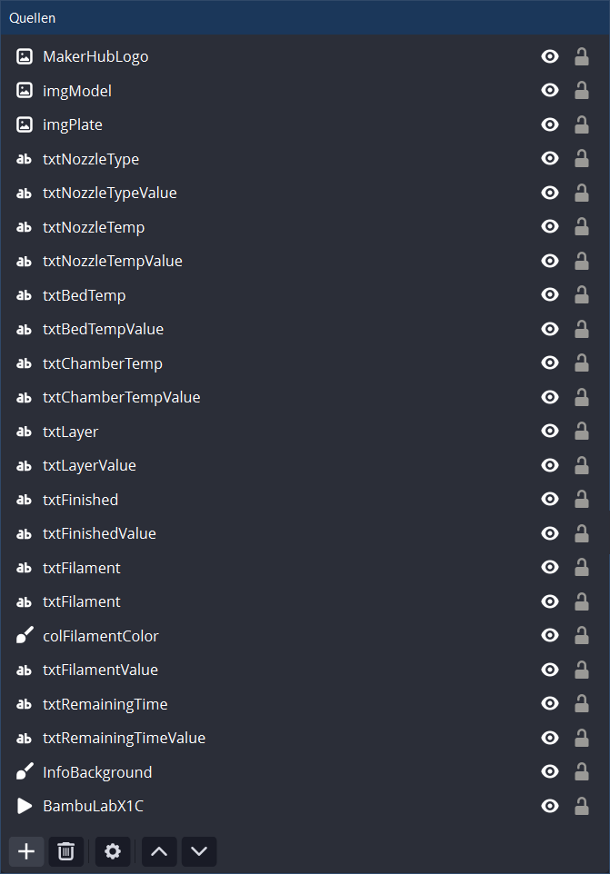
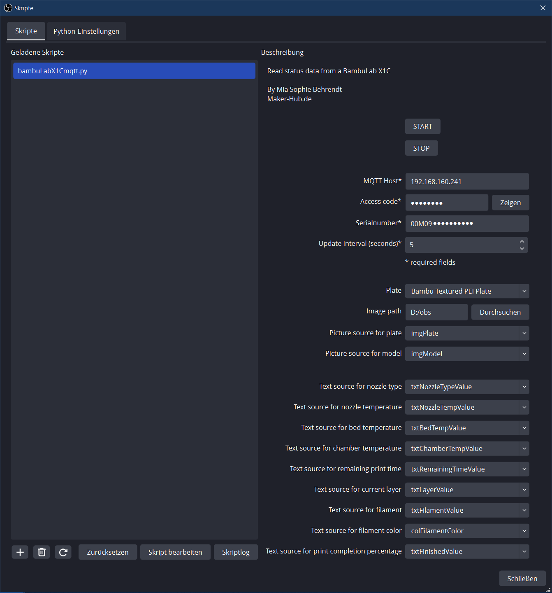

# obsbambuLabX1Cmqtt - OBS Script for BambuLab X1C Status Information including current model image

## Description
This OBS script allows users to get status information from a BambuLab X1C printer and show them in OBS. The information will be retrieved via MQTT and FTP protocols.

## Features
- Works in online mode as well in LAN-only mode
- Real-time monitoring of printer status
- Supports MQTT for data retrieval
- Fetches print information such as nozzle temperature, bed temperature, remaining time, etc.
- Updates text sources in OBS with the obtained data
- Periodic updates with user-defined intervals
- Integration with OBS sources for visual representation of the current model

## Requirement
- BambuLab X1 Carbon (it may work with other BambuLab printer as well; let me know)
- Python 3.6 or 3.11
- Paho MQTT client (paho-mqtt 2.0.0 for Python 3.11 (https://pypi.org/project/paho-mqtt/) or paho-mqtt 1.6.1 for Python 3.6 (https://pypi.org/project/paho-mqtt/1.6.1/))
- OBS Studio 30 (it may work with older version as well; let me know)
- For showing model image an SD-card in the printer is needed. Additionally: If you are using the online mode, you have to activate the option "Cache cloud print files to MicroSD card" in the printer option.

## Setup
1. Ensure that the required MQTT broker and FTP server are accessible.
2. Set the language variable in the script according to your preferred language.
3. Set up OBS text sources for displaying different print parameters such as nozzle temperature, bed temperature, etc.
4. Configure the script properties including the update interval and image paths for model and plate images.

Example of source definition: 

## Settings

- MQTT Host: Host address of the MQTT broker.
- Access Code: Password for accessing the MQTT broker.
- Serial Number: Serial number of the BambuLab X1C printer.
- Update Interval (seconds): Time interval for updating printer status information.
- Image path: Path to the directory containing model and plate images.
- Plate: Selection of different printer plates for visual representation.
- Picture source for plate: OBS source for displaying plate images.
- Picture source for model: OBS source for displaying model images.
- Text source for nozzle type: OBS source for displaying nozzle type information.
- Text source for nozzle temperature: OBS source for displaying nozzle temperature information.
- Text source for bed temperature: OBS source for displaying bed temperature information.
- Text source for chamber temperature: OBS source for displaying chamber temperature information.
- Text source for remaining print time: OBS source for displaying remaining print time information.
- Text source for current layer: OBS source for displaying current layer information.
- Text source for filament: OBS source for displaying filament information.
- Text source for filament color: OBS source for displaying filament color information.
- Text source for print completion percentage: OBS source for displaying print completion percentage.

## Usage
1. Start the script by clicking the "START" button.
2. The script will connect to the MQTT broker and start retrieving printer status data.
3. Monitor the OBS sources configured with the script for real-time updates on print status.
4. Stop the script by clicking the "STOP" button when monitoring is no longer required.

## Notes
Ensure that the required OBS sources are properly configured for accurate display of print status data.
Make sure to provide valid MQTT broker credentials and printer details for successful data retrieval.

It may not be the best Python code, but it runs quite stably. Sometimes, the MQTT connection breaks with return code 16 (https://github.com/eclipse/paho.mqtt.python/issues/683). This issue appears to be related to the frequency of notifications released by the X1C (one per second). To address this, I implemented a reconnect feature, and it works fine now. However, if you have any suggestions for improving this code further, you are warmly welcome to share them.
